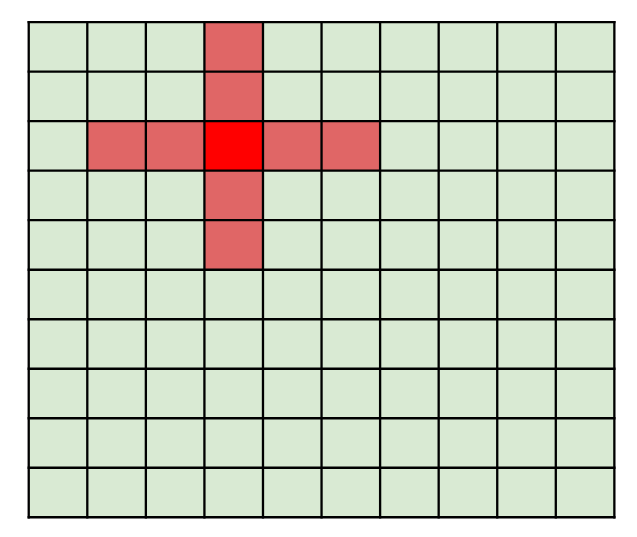

# Assignments : Introduction to CUDA (continued)

- **Exercise 1** 
  - Calculate the dot product of two vectors of size N using atomicAdd().
  - Start from file **dot_product.cu**.

- **Exercise 2** 
  - Apply a 2-D stencil of radius RADIUS on a 2-D square matrix of size DSIZE * DSIZE. 
  - The stencil is shown in the Figure below :
  
  



- Make use of shared memory :
  - Remember to also load into shared memory the 'halo' elements of the matrix.
- Start from file **stencil_2d.cu**.


## Remember

After connecting to a Wisconsin computing node: 

**To set-up your environment:**
```
ssh g38nXX # XX:01-16
export LD_LIBRARY_PATH=/usr/local/cuda/lib
export PATH=$PATH:/usr/local/cuda/bin
```

**To compile:**

```
nvcc my_script.cu -o my_script
```

**To run:**

```
./my_script
```
